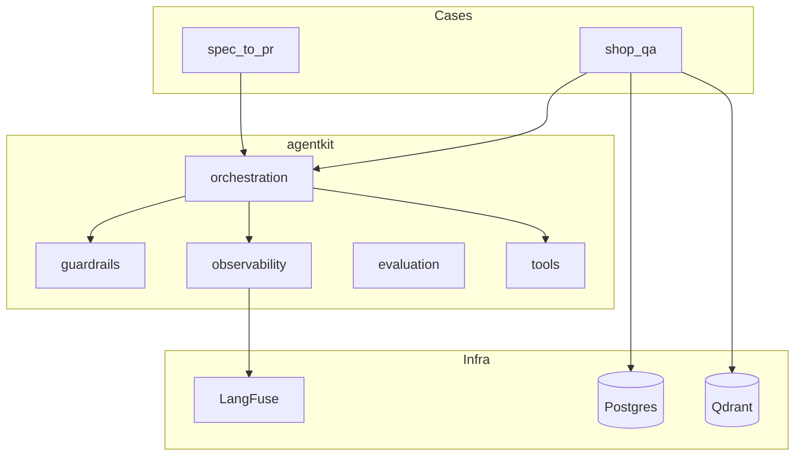
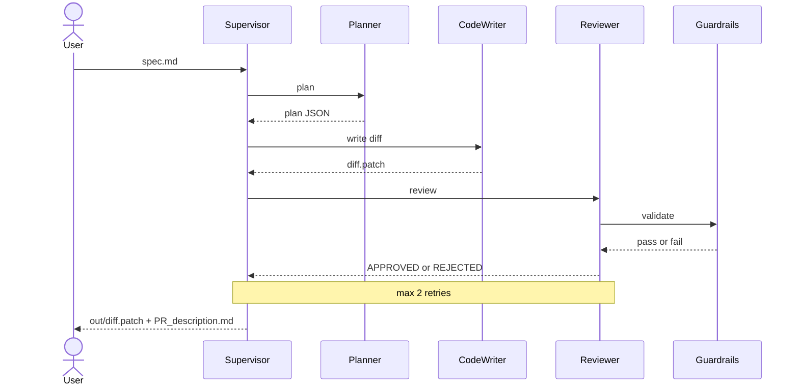
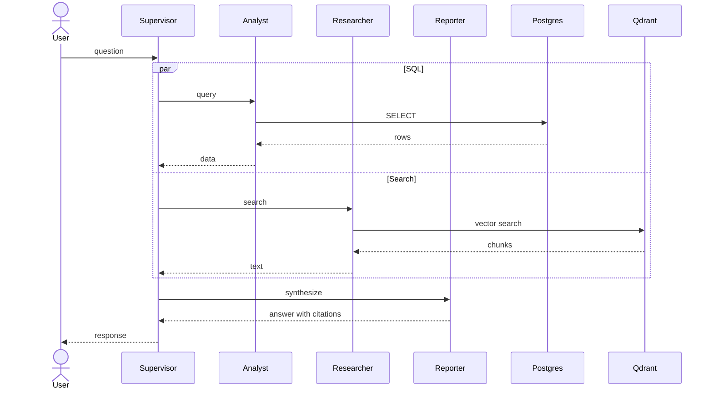

# framework_multiagentes

**A reusable multi-agent AI (Artificial Intelligence) platform with production-grade guardrails, observability, and evaluation.**

  

---

## Quickstart

Three commands to a running system:

```bash
git clone https://github.com/<user>/framework_multiagentes.git
cd framework_multiagentes
cp .env.example .env        # add your OPENAI_API_KEY
make setup                  # docker compose up + pip install
make run-case1 SPEC=cases/spec_to_pr/examples/feature_health.md
```

Expected output: `out/diff.patch` and `out/PR_description.md`

---

## Overview

Engineering teams build AI agents the same way they built macros twenty years ago: each use case is an isolated prototype with no shared standards, no safety mechanisms, and no cost visibility. Most never reach production.

`framework_multiagentes` is an open-source platform that treats agents as a reliable workforce rather than one-off experiments. Five production capabilities — orchestration, guardrails, observability, evaluation, and governed tools — are implemented once and reused across any number of use cases.

Two fully working cases run on the same framework:

- **`spec_to_pr`** — reads a markdown specification and produces a code diff plus a PR (Pull Request) description draft
- **`shop_qa`** — answers business questions by combining SQL (Structured Query Language) over Postgres with semantic search over Qdrant, with mandatory source citations

The same infrastructure serving two unrelated domains is the central argument: this is a platform, not a demo.

---

## Architecture



**Legend:**

| Component | Responsibility |
|-----------|---------------|
| Cases | Domain-specific agent workflows that consume the agentkit framework |
| orchestration | LangGraph (Language Graph) StateGraph, SupervisorAgent, BaseAgent, and AgentState definitions |
| guardrails | Input validation, PolicyGate, and OutputValidator — implemented as code, not as prompt instructions |
| observability | LangFuse (Language Fuse) tracing, structured JSON logging, and token/cost metrics |
| evaluation | DeepEval (Deep Evaluation) harness, golden datasets, and automated quality gates |
| tools | Governed tool catalog shared across all cases |
| Postgres | Relational store — the authoritative ledger for structured facts |
| Qdrant | Vector store — semantic memory for unstructured documents |
| LangFuse | Self-hosted observability backend — traces, costs, and latency dashboards |

---

## Cases

### Case 1 — spec_to_pr

A Supervisor coordinates three specialist agents: a Planner that decomposes the specification, a CodeWriter that produces the diff, and a Reviewer that validates quality through the guardrails layer. The loop retries at most twice before returning a final result.



```bash
make run-case1 SPEC=cases/spec_to_pr/examples/feature_health.md
```

### Case 2 — shop_qa

A Supervisor fans out to two parallel agents — an Analyst that queries Postgres and a Researcher that queries Qdrant — then passes both results to a Reporter that synthesizes a cited answer. Every response must include explicit source attribution; responses without citations are rejected by the output guardrail.



```bash
make run-case2
# or via UI:
make ui   # then open http://localhost:8000 and type: /qa Qual a média de avaliação dos produtos?
```

---

## Framework Modules

| Module | Responsibility |
|--------|---------------|
| `agentkit/orchestration` | LangGraph (Language Graph) StateGraph, SupervisorAgent, BaseAgent, AgentState |
| `agentkit/guardrails` | Input validation (Pydantic), PolicyGate (SQL-only, file paths), OutputValidator (citations, secrets) |
| `agentkit/observability` | LangFuse tracing, JSON structured logging, token/cost metrics |
| `agentkit/evaluation` | DeepEval (Deep Evaluation) harness, golden datasets, `make eval` CI (Continuous Integration) gate |
| `agentkit/tools` | `run_sql` (SELECT-only), `vector_search`, `read_file`, `write_file`, `web_search`, `github_ro` |

---

## Architecture Decisions

Each significant technical choice is documented in an ADR (Architecture Decision Record) covering context, alternatives considered, and consequences.

| ADR | Decision |
|-----|----------|
| [0001](docs/adr/0001-langgraph-vs-crewai.md) | LangGraph vs CrewAI |
| [0002](docs/adr/0002-guardrails-as-layer.md) | Guardrails as explicit code layer |
| [0003](docs/adr/0003-langfuse-observability.md) | LangFuse self-hosted observability |
| [0004](docs/adr/0004-deepeval-quality-gates.md) | DeepEval quality gates |
| [0005](docs/adr/0005-llm-provider-strategy.md) | LLM (Large Language Model) provider abstraction |
| [0006](docs/adr/0006-agents-as-24x7-workforce.md) | Agents as 24/7 workforce (job queue) |
| [0007](docs/adr/0007-reproducibility-docker.md) | Full local reproducibility via Docker |

For a quick read: start with ADR 0001, 0002, and 0006.

---

## Development

```bash
make test    # run pytest
make eval    # run evaluation harness against golden datasets
make lint    # ruff check
make fmt     # ruff format
```

Full test coverage is in `tests/`: `test_guardrails.py`, `test_tools.py`, and `test_orchestration.py`.

---

## Environment Variables

Copy `.env.example` to `.env` and fill in required values. Infrastructure variables (`POSTGRES_*`, `QDRANT_URL`, `LANGFUSE_HOST`) are pre-configured for the Docker Compose stack and require no changes for local development.

| Variable | Required | Description |
|----------|----------|-------------|
| `OPENAI_API_KEY` | Yes | OpenAI API key — used by all agents (default model: gpt-4o-mini) |
| `ANTHROPIC_API_KEY` | No | Anthropic Claude — alternative LLM (Large Language Model) provider |
| `POSTGRES_*` | Yes (auto via Docker) | Postgres connection details |
| `QDRANT_URL` | Yes (auto via Docker) | Qdrant vector store URL |
| `LANGFUSE_*` | No | LangFuse (Language Fuse) observability keys — self-hosted via Docker |
| `TAVILY_API_KEY` | No | Tavily web search — only required when using the `web_search` tool |

---

## Roadmap

| Phase | Item |
|-------|------|
| Current | Case 1 (spec_to_pr), agentkit framework, 7 ADRs |
| Phase 2 | Case 2 shop_qa full UI, evaluation goldens |
| Phase 3 | 24/7 job queue implementation (ADR 0006) |
| Phase 4 | Tester agent (auto-generate pytest for diffs) |
| Phase 5 | Multi-tenant isolation, domain-specific tool catalogs |

---

## License

MIT License — see LICENSE file.
