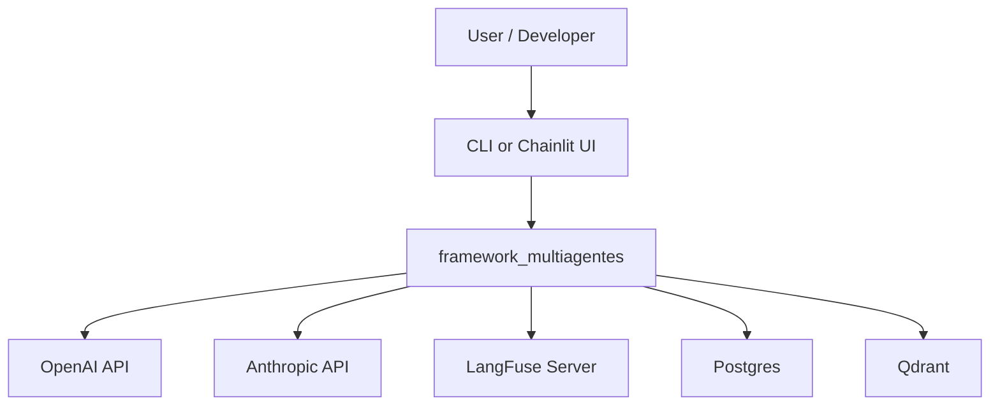
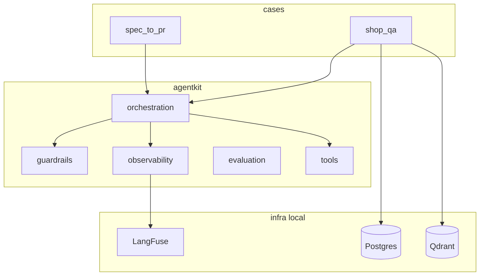
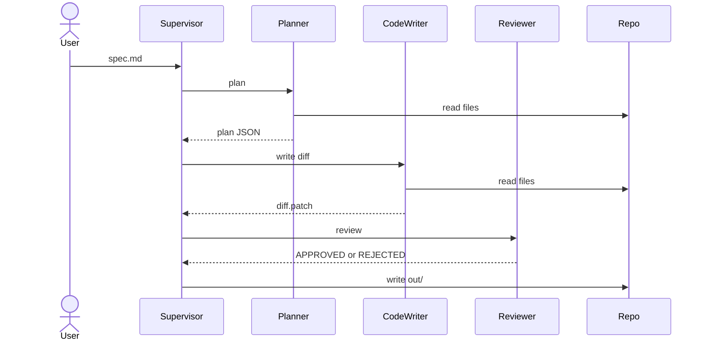
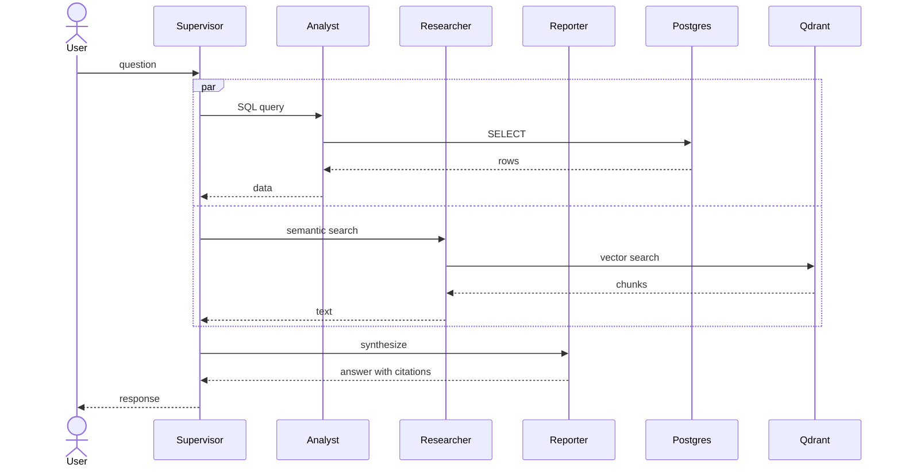

# Architecture — framework_multiagentes

## Overview

`framework_multiagentes` is a reusable AI agents platform. Its architecture separates the **framework** (generic infrastructure) from the **cases** (domain-specific applications), proving reusability across unrelated domains.

## C4 Model — Context

## C4 Model — Container

## Key architectural decisions

| Decision | Record |
|----------|--------|
| LangGraph vs CrewAI | [ADR 0001](adr/0001-langgraph-vs-crewai.md) |
| Guardrails as code layer | [ADR 0002](adr/0002-guardrails-as-layer.md) |
| LangFuse observability | [ADR 0003](adr/0003-langfuse-observability.md) |
| DeepEval quality gates | [ADR 0004](adr/0004-deepeval-quality-gates.md) |
| LLM provider abstraction | [ADR 0005](adr/0005-llm-provider-strategy.md) |
| 24/7 workforce queue | [ADR 0006](adr/0006-agents-as-24x7-workforce.md) |
| Docker reproducibility | [ADR 0007](adr/0007-reproducibility-docker.md) |

## Data flows

### Case 1 — spec_to_pr

### Case 2 — shop_qa

## Module responsibilities

### `agentkit/orchestration/`
- `state.py` — `AgentState` TypedDict shared across all graph nodes
- `agent_base.py` — `BaseAgent` abstract class; all specialists extend it
- `supervisor.py` — `SupervisorAgent` routes work based on `current_agent` in state
- `graph_builder.py` — builds LangGraph `StateGraph` from supervisor + specialists

### `agentkit/guardrails/`
- `inputs.py` — Pydantic v2 input validation, prompt-injection detection
- `policies.py` — `PolicyGate`: SQL-only-SELECT, file-write-to-out/, read-within-workspace
- `outputs.py` — `OutputValidator`: max size, no secrets, mandatory citations
- `middleware.py` — `@wrap_tool_call`: retry, error handling, structured logging

### `agentkit/observability/`
- `logging.py` — JSON-structured logger, `log_span` context manager
- `tracing.py` — LangFuse trace context manager (no-op without key)
- `metrics.py` — `TokenCounterCallback` for per-run cost tracking

### `agentkit/evaluation/`
- `harness.py` — loads golden datasets, runs cases, collects metrics
- `criteria.py` — DeepEval metric definitions
- `goldens/` — version-controlled test cases (input + expected behavior)

### `agentkit/tools/`
- `file_ops.py` — `read_file`, `write_file`, `list_files` (policy-enforced)
- `sql_safe.py` — `run_sql` (SELECT-only, LIMIT mandatory)
- `vector_search.py` — `vector_search` (Qdrant semantic search)
- `web_search.py` — `web_search` (Tavily, optional)
- `github_ro.py` — `github_list_files`, `github_read_file` (public repos, read-only)
