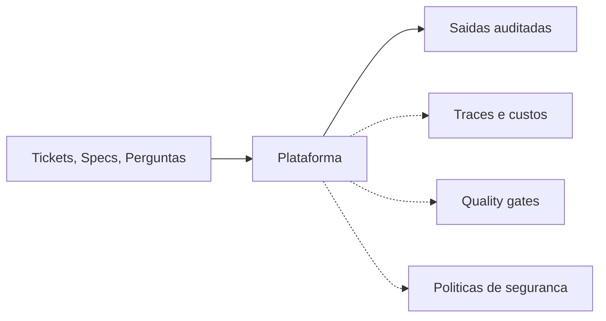

# Executive Summary — `framework_multiagentes`

> **One-liner:** Uma plataforma open source que transforma agentes de IA (Inteligência Artificial) de *experimentos isolados* em *força de trabalho confiável*, com governança, observabilidade e qualidade auditável.

---

## O problema

Times de engenharia hoje constroem agentes de IA da mesma forma que construíam macros há 20 anos: cada caso de uso é um protótipo isolado, sem padrões compartilhados, sem mecanismos de segurança, sem visibilidade de custo. O resultado é previsível:

- **Não chega a produção.** Falta de guardrails (camadas de segurança e qualidade) e de monitoramento impede colocar agentes na frente de usuários reais.
- **Não escala.** Cada novo caso de uso é reescrito do zero, sem reaproveitar a infraestrutura.
- **Não dá para auditar.** Sem rastros (traces) e sem testes objetivos de qualidade, a operação fica refém do "achismo": ninguém sabe o que o agente fez, quanto custou, ou se a resposta está correta.

A indústria fala em "AI Agents como força de trabalho 24/7" — mas a maioria das implementações são demos elegantes que falham no contato com o mundo real.

## O que este projeto entrega

`framework_multiagentes` é uma **plataforma reutilizável** com cinco capacidades de produção, mais dois casos reais que provam a reutilização:

| Capacidade | O que faz | Por que importa para o negócio |
|------------|-----------|-------------------------------|
| **Orquestração** | Coordena múltiplos agentes especialistas em fluxos confiáveis. | Permite dividir tarefas complexas em etapas auditáveis, com retomada de execução em caso de falha. |
| **Guardrails** | Camada explícita de validação (entrada, política, saída). | Bloqueia ações destrutivas, vazamento de dados sensíveis e respostas alucinadas — *antes* que cheguem ao usuário. |
| **Observabilidade** | Captura cada chamada, custo, latência e decisão. | Toda operação tem rastro. Custo por agente, por execução, por usuário. |
| **Avaliação** | Suíte de testes automatizada com casos-padrão (golden datasets). | Qualidade vira métrica objetiva. Mudanças no prompt ou no modelo são validadas antes de subir. |
| **Tools governadas** | Catálogo de ferramentas reutilizáveis (SQL seguro, busca, arquivos). | Padroniza o que os agentes podem fazer — e *especialmente* o que não podem. |

**Casos demonstrativos rodando em cima da mesma base:**

1. **`dev_agent`** — recebe uma especificação em linguagem natural e devolve um Pull Request draft (modificações de código + descrição). Demonstração da promessa "tickets viram código".
2. **`analyst_agent`** — responde perguntas de negócio combinando dados estruturados (números autoritativos) e não estruturados (texto livre), sempre com citação da fonte. Demonstração da arquitetura "Ledger + Memory" que separa fato de contexto.

A reutilização do mesmo framework em dois domínios completamente distintos é o argumento central: **não é uma demo, é uma plataforma**.

## Diferencial estratégico

Três decisões arquiteturais separam este projeto de protótipos comuns:

1. **Guardrails como camada, não como prompt.** Restringir comportamento por instrução em prompt é frágil — qualquer alteração no modelo quebra a contenção. Aqui, validação é código: `Pydantic` na entrada, `PolicyGate` (regras explícitas) no meio, `OutputValidator` na saída. Auditável e testável.

2. **Open source self-hosted por padrão.** Toda a stack de observabilidade e avaliação roda localmente em `docker compose up`. Sem vendor lock-in, sem custos de plataforma para experimentar, sem expor dados sensíveis a SaaS externo.

3. **Decisões documentadas (ADRs — Architecture Decision Records).** Cada escolha técnica relevante tem um documento curto explicando contexto, alternativas e consequências. Isso transforma o repositório em um artefato de **engenharia organizacional**, não só código.

## Riscos endereçados

| Risco operacional típico de agentes de IA | Como o framework trata |
|-------------------------------------------|------------------------|
| Agente executa ação destrutiva (SQL `DELETE`, escrita em arquivo errado) | `PolicyGate` bloqueia em runtime, antes da execução. SQL é restrito a `SELECT` com `LIMIT` obrigatório; escrita de arquivo limitada a diretório `out/`. |
| Custo descontrolado (agente em loop de retry) | Loops são *bounded* (máximo 2 retries por agente). Cada chamada tem trace de tokens e custo no LangFuse. |
| Resposta alucinada / sem fundamento | Output validator exige citação de fonte (linha SQL ou trecho de documento). Resposta sem citação é rejeitada. |
| Vazamento de dados sensíveis (PII — Personally Identifiable Information / dados pessoais identificáveis) | Output guardrail aplica regex de segredos (API keys) e checklist de PII antes de retornar. |
| Mudança no provedor de LLM quebra o sistema | Camada de abstração `init_chat_model` permite trocar OpenAI ↔ Anthropic ↔ Bedrock sem reescrever lógica. |
| Falta de rastreabilidade em incidente | Cada execução é um trace completo no LangFuse: quais agentes rodaram, em que ordem, quanto custou, qual prompt foi usado. |

## Modelo "agentes 24/7" — caminho documentado

A visão de agentes como *força de trabalho contínua* (sempre ligados, processando filas de trabalho) é tratada explicitamente no **ADR 0006**:

- Workers stateless consomem jobs de uma fila.
- Cada job carrega uma `idempotency key` para evitar processamento duplicado.
- Trace ID propagado entre job e plataforma de observabilidade.
- LangGraph (motor de orquestração) tem `checkpointer` nativo que permite **retomar execução** após falha — em qualquer ponto do fluxo, sem reprocessar etapas anteriores.

A decisão arquitetural está pronta. A implementação da fila é incremento natural — o framework já suporta a abstração.

## O que isso demonstra

Para liderança técnica avaliando o projeto:

- **Pensamento de plataforma**, não de protótipo. Cada decisão favorece reuso, governança e operabilidade.
- **Trade-offs explícitos**. ADRs documentam não só o que foi escolhido, mas o que foi **rejeitado** e por quê.
- **Capacidade de *ship***. O repositório é reproduzível em qualquer máquina com dois comandos. Sem "funciona no meu computador".
- **Ponte entre hands-on e arquitetura**. O código existe, roda, gera artefatos verificáveis (`diff.patch`, traces, métricas). Não é diagrama de PowerPoint.

## Próximos passos naturais

| Fase | Entrega |
|------|---------|
| **Atual** | Framework + Case 1 funcionando + ADRs essenciais. |
| **Curto prazo** | Case 2 completo, suíte de avaliação com goldens versionados, UI conversacional. |
| **Médio prazo** | Implementação da fila + workers (ADR 0006). Integração com sistema real de tickets (Linear, Jira). |
| **Longo prazo** | Catálogo de tools por domínio (jurídico, financeiro, suporte). Multi-tenancy com isolamento de dados. |

---

**Repositório:** [github.com/<user>/framework_multiagentes](https://github.com/) (público, MIT License).
**Stack:** Python 3.11+, LangChain, LangGraph, Postgres, Qdrant, LangFuse, DeepEval, Chainlit.
**Para quem está com pressa:** leia o `README.md` (Quickstart em 3 comandos) e os ADRs `0001`, `0002`, `0006`.
