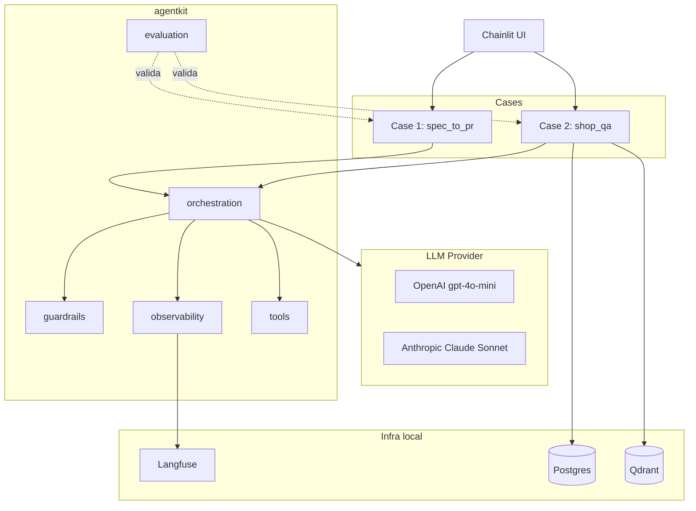
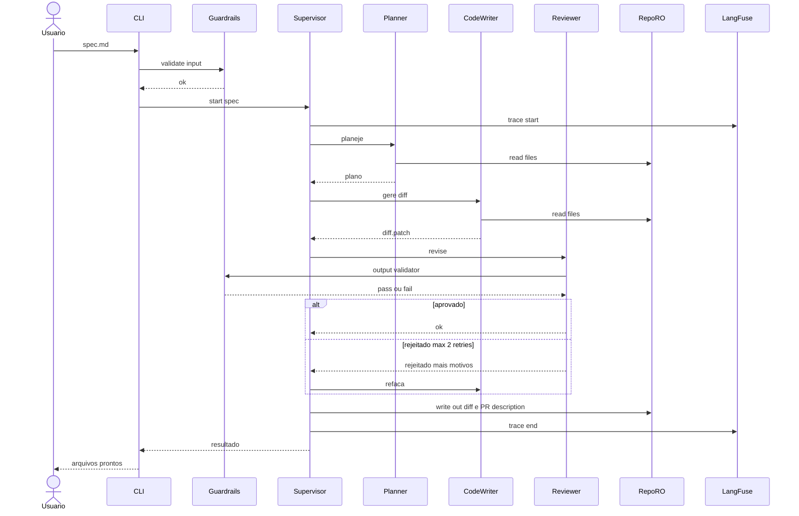
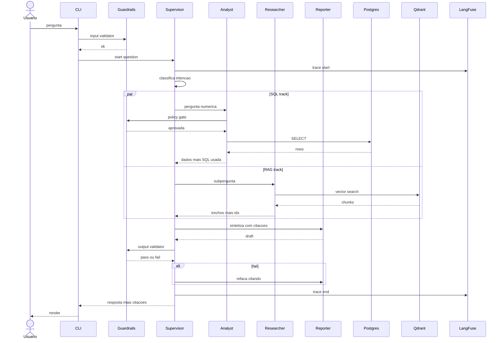

# framework_multiagentes — Plano do projeto

> **Status:** design completo, pronto para implementação.
> **Última atualização:** 2026-04-27.
> **Autor:** Antonio Jansen.

---

## 1. Visão geral

`framework_multiagentes` é um projeto de portfólio que demonstra, em código aberto, como construir uma **plataforma reutilizável de agentes de IA (Inteligência Artificial)** com qualidade de produção: orquestração multi-agente, guardrails (camadas de segurança e qualidade), observabilidade, avaliação automatizada e governança.

O repositório é estruturado em duas partes:

1. **`agentkit/`** — framework reutilizável (5 módulos: orquestração, guardrails, observabilidade, avaliação, tools).
2. **`cases/`** — duas aplicações finas que provam que o framework é multi-domínio:
   - **Case 1 — `spec_to_pr`**: lê uma spec em markdown e gera um Pull Request draft (`diff.patch` + descrição).
   - **Case 2 — `shop_qa`**: responde perguntas de negócio combinando dados estruturados (Postgres) e textuais (Qdrant), com citação de fontes.

A intenção é mostrar **arquitetura de plataforma**, não só protótipos isolados — a mesma base sustenta domínios diferentes.

## 2. Decisões principais

| Tema | Decisão |
|------|---------|
| Abordagem | Framework reutilizável + 2 cases provando reusabilidade + 7 ADRs (Architecture Decision Records — Registros de Decisão Arquitetural) |
| Stack principal | LangChain + LangGraph, Postgres + Qdrant, LangFuse (open source self-hosted), DeepEval, Chainlit |
| Provider LLM (Large Language Model — modelo de linguagem grande) | OpenAI `gpt-4o-mini` por padrão; `init_chat_model` permite trocar para Anthropic Claude Sonnet sem reescrever código |
| Diagramas | Mermaid embedded em markdown (renderiza nativo no GitHub) |
| Reprodutibilidade | `docker compose up` + `cp .env.example .env` — sem dependência de cloud paga |
| Saída do Case 1 | `out/diff.patch` + `out/PR_description.md` (sem token GitHub, sem write em repo externo) |
| Acrônimos | Sempre explicados entre parênteses na primeira ocorrência |

## 3. Arquitetura



**Legenda dos componentes:**

- **Cases** — aplicações finas que usam o framework.
- **agentkit** — framework reutilizável.
  - `orchestration` — LangGraph supervisor.
  - `guardrails` — Pydantic + policies + output validator.
  - `observability` — LangFuse + structured logging.
  - `evaluation` — DeepEval + golden datasets.
  - `tools` — `sql_safe`, `vector_search`, `file_ops`, `web_search`, `github_ro`.
- **Infra local** — Postgres ("The Ledger"), Qdrant ("The Memory"), Langfuse server (Docker Compose).
- **LLM Provider** — OpenAI por padrão; Anthropic opcional via `init_chat_model`.

**Princípios da arquitetura:**

- Framework primeiro, cases depois. Cada case tem só 3 arquivos próprios (`main.py`, `prompts.py`, `tools.py`) — se ficar gordo, é sinal de que o framework está faltando algo.
- Single Responsibility por módulo do framework.
- Tudo roda local. Zero cloud paga para demonstrar.
- LangFuse e DeepEval são open source self-hosted no mesmo `docker-compose.yml`.

## 4. Estrutura de pastas

```
framework_multiagentes/
├── agentkit/                        # FRAMEWORK reutilizável
│   ├── orchestration/
│   │   ├── state.py                 # State (TypedDict do LangGraph)
│   │   ├── agent_base.py            # Classe base p/ specialist
│   │   ├── supervisor.py            # SupervisorAgent
│   │   └── graph_builder.py         # Builder helper
│   │
│   ├── guardrails/
│   │   ├── inputs.py                # Validação Pydantic + @validate_input
│   │   ├── policies.py              # PolicyGate (SELECT-only, no DELETE, paths)
│   │   ├── outputs.py               # OutputValidator (max diff, citação, no-PII)
│   │   └── middleware.py            # Middlewares @wrap_tool_call
│   │
│   ├── observability/
│   │   ├── tracing.py               # LangFuse + @traced
│   │   ├── logging.py               # Logger JSON estruturado
│   │   └── metrics.py               # Contador tokens/custo
│   │
│   ├── evaluation/
│   │   ├── harness.py               # Runner que carrega goldens
│   │   ├── criteria.py              # Métricas DeepEval
│   │   └── goldens/
│   │       ├── spec_to_pr.json
│   │       └── shop_qa.json
│   │
│   └── tools/
│       ├── web_search.py            # Tavily wrapper
│       ├── sql_safe.py              # SQL SELECT-only c/ LIMIT
│       ├── vector_search.py         # Qdrant wrapper p/ RAG
│       ├── file_ops.py              # Read/write seguro no workspace
│       └── github_ro.py             # Read-only repo
│
├── cases/                           # APLICAÇÕES finas
│   ├── spec_to_pr/
│   │   ├── main.py                  # Compõe Planner + CodeWriter + Reviewer
│   │   ├── prompts.py
│   │   ├── tools.py                 # Tools específicas (gerar diff, lint diff)
│   │   ├── sample_repo/             # FastAPI minúsculo (autocontido)
│   │   └── examples/                # Specs de entrada (.md)
│   │
│   └── shop_qa/
│       ├── main.py                  # Compõe Analyst + Researcher + Reporter
│       ├── prompts.py
│       └── tools.py
│
├── docs/
│   ├── adr/                         # ADRs
│   │   ├── 0001-langgraph-vs-crewai.md
│   │   ├── 0002-guardrails-as-layer.md
│   │   ├── 0003-langfuse-observability.md
│   │   ├── 0004-deepeval-quality-gates.md
│   │   ├── 0005-llm-provider-strategy.md
│   │   ├── 0006-agents-as-24x7-workforce.md
│   │   └── 0007-reproducibility-docker.md
│   ├── architecture.md              # Diagramas C4
│   └── adr-template.md
│
├── infra/
│   ├── docker-compose.yml           # Postgres + Qdrant + LangFuse + Chainlit
│   ├── init.sql                     # Schema do Postgres
│   └── seed/                        # Dados de exemplo
│
├── ui/
│   └── chainlit_app.py              # Interface conversacional p/ os 2 cases
│
├── tests/
│   ├── test_guardrails.py
│   ├── test_orchestration.py
│   └── test_tools.py
│
├── _references/                     # acervo do que inspirou (não vai pro Git público)
│
├── .env.example                     # TODAS as variáveis documentadas
├── pyproject.toml                   # Versões pinadas
├── Makefile                         # `make setup`, `make run-case1`, `make eval`, `make test`
├── pre-commit-config.yaml
└── README.md                        # Quickstart + arquitetura + cases
```

## 5. ADRs (Architecture Decision Records — Registros de Decisão Arquitetural)

| # | Título | Decisão central |
|---|--------|----------------|
| 0001 | LangGraph vs CrewAI | LangGraph — controle fino de estado, melhor p/ guardrails |
| 0002 | Guardrails como camada | Camada explícita (input/policy/output) > inline em prompt |
| 0003 | LangFuse self-hosted | Open source, traces + custo, sem vendor lock-in |
| 0004 | DeepEval p/ quality gates | Goldens versionados; falha em CI bloqueia merge |
| 0005 | LLM provider strategy | OpenAI default + `init_chat_model` p/ trocar Anthropic/Bedrock |
| 0006 | Agentes como força de trabalho 24/7 | Fila + workers idempotentes + checkpointer LangGraph |
| 0007 | Reprodutibilidade Docker | `docker compose up`; sem cloud paga p/ demo |

**Detalhe do ADR 0006 — Agentes 24/7:**

- Decisão documentada, implementação **fora do escopo do MVP (Minimum Viable Product — produto mínimo viável)**.
- Fila: Postgres-based (mesmo banco já em uso) ou Redis Streams — sem novo serviço externo.
- Workers stateless consumindo jobs; **idempotency key** no payload p/ evitar duplo trabalho.
- Trace ID propagado entre job e LangFuse p/ correlação.
- Retry com backoff + dead-letter queue.
- Já habilitado pelo LangGraph: `SqliteSaver` em dev, `PostgresSaver` em prod, retomada de execução via `thread_id`.

## 6. Case 1 — `spec_to_pr`

**Entrada:** arquivo markdown com uma spec curta de feature.
**Saída:** `out/diff.patch` (aplicável com `git apply`) + `out/PR_description.md`.

**Agentes (3):**
- **Planner** — lê spec, lista arquivos a tocar e passos.
- **CodeWriter** — gera diff unificado.
- **Reviewer** — valida diff via guardrails; aprova ou devolve com motivos.

**Loop CodeWriter ↔ Reviewer bounded em 2 retries.**



**Legenda:** `RepoRO` = repositório de exemplo em modo read-only (apenas leitura). Cada participante representa um componente lógico — agentes (Planner, CodeWriter, Reviewer) e infraestrutura de plataforma (Guardrails, Supervisor, LangFuse).

**Garantias de segurança:**
- File system **read-only** para os agentes; só o supervisor escreve em `out/`.
- Output guardrail bloqueia: diff acima de N linhas, segredos detectados (regex de API keys), arquivos fora do plano.
- Loop bounded — máximo 2 retries evita custo descontrolado.

**Tester (4º agente que gera testes pytest) — Phase 2** (documentado, fora do MVP).

## 7. Case 2 — `shop_qa`

**Entrada:** pergunta de negócio em linguagem natural.
**Saída:** resposta textual com citações (linhas SQL + trechos de reviews).

**Stack:** Postgres = "The Ledger" (números autoritativos), Qdrant = "The Memory" (texto livre).

**Agentes (3):**
- **Analyst** — SQL via `tools/sql_safe.py` (SELECT-only, LIMIT obrigatório).
- **Researcher** — busca semântica no Qdrant.
- **Reporter** — sintetiza com citações.



**Legenda:** *SQL track* e *RAG track* (Retrieval-Augmented Generation — geração aumentada por recuperação) rodam em paralelo via bloco `par` do LangGraph. O Supervisor decide dinamicamente quais tracks ativar de acordo com a intenção da pergunta.

**Por que esse case existe:** prova que o `agentkit/` é multi-domínio. O mesmo Supervisor, os mesmos guardrails, o mesmo tracing e o mesmo eval harness sustentam um caso completamente diferente do Case 1. Esse é o argumento mais difícil de fingir: reutilização efetiva.

**Dataset semente:** domínio neutro fictício (Loja de Brinquedos com 200 pedidos + 50 reviews fake). Em escopo de Phase 2.

## 8. Quickstart

```bash
# 1. Clone e config
git clone https://github.com/<user>/framework_multiagentes.git
cd framework_multiagentes
cp .env.example .env   # editar OPENAI_API_KEY

# 2. Subir tudo
make setup             # docker compose up -d + pip install -e .

# 3. Rodar o Case 1 (gera out/diff.patch + out/PR_description.md)
make run-case1 SPEC=cases/spec_to_pr/examples/feature_health.md

# (Opcional) UI conversacional
make ui                # http://localhost:8000
```

## 9. Plano de implementação por fases

Cada fase termina em commit. Repo nunca fica quebrado.

### Phase 1 — Bootstrap

- `pyproject.toml` com versões pinadas
- `.env.example`, `.gitignore`
- `Makefile` (`setup`, `run-case1`, `test`, `eval`, `ui`)
- `docker-compose.yml` (Postgres + Qdrant + LangFuse)
- `pre-commit-config.yaml`
- README esqueleto
- 1º commit

**DOD (Definition of Done — critério de pronto):** `docker compose up -d` sobe os 3 serviços; `pre-commit run --all-files` passa.

### Phase 2 — `agentkit/` skeleton

- `orchestration/` — state, agent_base, supervisor, graph_builder
- `guardrails/` — inputs (Pydantic), policies, outputs, middleware
- `observability/` — tracing (LangFuse), logging JSON
- `tools/` — `file_ops`, `sql_safe`
- 4-5 testes-chave dos guardrails

**DOD:** `pytest tests/` verde; smoke test do supervisor com 1 agente dummy.

### Phase 3 — Case 1 `spec_to_pr` end-to-end

- `sample_repo/` (FastAPI minúsculo: 2 endpoints)
- 2 `examples/feature_*.md`
- `prompts.py` (Planner / CodeWriter / Reviewer)
- `tools.py` (gerar diff)
- `main.py`
- `make run-case1` rodando

**DOD:** `make run-case1 SPEC=...` gera `out/diff.patch` válido (`git apply --check` passa) + `out/PR_description.md`; trace aparece no LangFuse local.

### Phase 4 — ADRs

7 ADRs no formato Nygard (Status / Contexto / Decisão / Consequências) em `docs/adr/`.

**DOD:** os 7 arquivos existem, todos com link recíproco quando se referenciam.

### Phase 5 — README final + diagramas

- Quickstart no topo
- Diagrama Mermaid de arquitetura
- "Como rodar Case 1" com print do output
- Seção "Decisões" linkando ADRs
- Roadmap (Case 2, eval, fila 24/7)

**DOD:** README abre limpo no GitHub, todos os Mermaid renderizam, sem links quebrados.

### Phase 6 — Push para GitHub

- Cria repo público
- Push com tag `v0.1.0`
- Screenshot do output do Case 1 em `docs/screenshots/`

### Phase 7 (extensões pós-MVP)

| # | Item |
|---|------|
| 7.1 | Case 2 `shop_qa` minimalista (CLI) |
| 7.2 | `evaluation/` com 1 golden por case |
| 7.3 | UI Chainlit |
| 7.4 | Fila + workers (implementação do ADR 0006) |
| 7.5 | Hero diagram Excalidraw no topo do README |
| 7.6 | Tester (4º agente do Case 1) |

## 10. Princípios anti-overengineering

- Cada agente pode começar como uma chamada `create_react_agent` com prompt + tools — não criar 5 níveis de abstração.
- `graph_builder.py` é nice-to-have. Se apertar, supervisor monta o grafo inline em cada `case/main.py`.
- Guardrails primeiro com regex e Pydantic simples, não LLM-as-judge — economiza tempo e tokens.
- Não escrever testes além do essencial (3-5 testes pros guardrails, 1 smoke E2E pro Case 1) — qualidade aqui é "funciona", não "100% coverage".
- Reaproveitar agressivamente patterns conhecidos sem copiar literalmente — adaptar com nomes próprios e Pydantic mais explícito.

## 11. Critério de pronto do MVP

- [ ] README com quickstart funcional (1-2 comandos) e arquitetura visualizada
- [ ] Case 1 rodando end-to-end (gera `diff.patch` real a partir de spec)
- [ ] Pelo menos 3 ADRs escritos (0001, 0002, 0006 são os mais defensáveis)
- [ ] LangFuse capturando traces de ao menos 1 execução
- [ ] Repo público no GitHub
- [ ] `pytest tests/` verde

---

**Arquivo gerado em colaboração com Claude (Opus 4.7) em 2026-04-27.**
